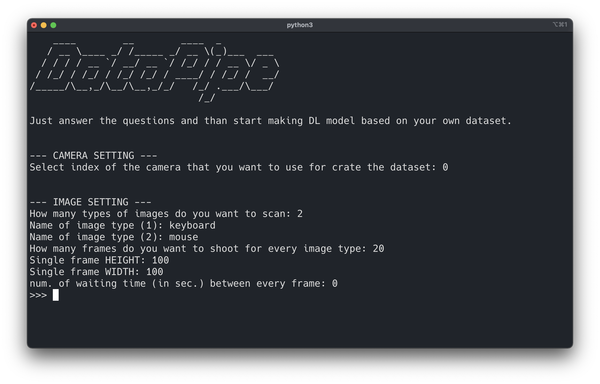

# Introduction

Xeye is a package for create dataset for computer vision application based on inferencial results of deep learning models. Xeye is born for these main reasons:

* Create dataset using only a laptop and its integrated camera (or alternatively an external usb camera);
* Create dataset already structured like the [mnist](https://www.tensorflow.org/datasets/catalog/mnist);
* Create dataset that can be use for build models with [Tensorflow](https://www.tensorflow.org/) or [Pytorch](https://pytorch.org/).

## Installation

To install the current release, 

```
pip install xeye
```

## Dynamic API UI

First of all, load the module datapipe from the package:

```python
from xeye import datapipe as dp
```

then initialize the instance like this 

```python
data = dp.dataset()
```
set the parameters related to the images with the **init** function

```python
data.init()
```
the execution of this function cause the starting of the user interface in terminal


the **init** function arise multiple questions that set the parameters values



in more detail the questions refer to:

* **Select index of the camera that you want to use for create the dataset**: generally 0 for inernal camera 1 for usb external camera.
* **How many types of images do you want to scan**: answer 2 if you want to create a dataset with 2 objects (e.g. keyboard and mouse)...answer with the number of objects types that you want to include in your dataset.
* **Name of image type**: insert the name for every specif object that you you want to include in the dataset. The **init** function create a named folder for every images types to include. 
* **How many frames do you want to shoot for every image type**: select the number of images do you want to shoot and save in every object folder that compose the dataset. 
* **Single frame HEIGHT**: frame height values.
* **Single frame WIDTH**: frame width values.
* **num. of waiting time (in sec.) between every frame**: e.g 0.2 cause a waiting time of 0.2 seconds between every shoot.
