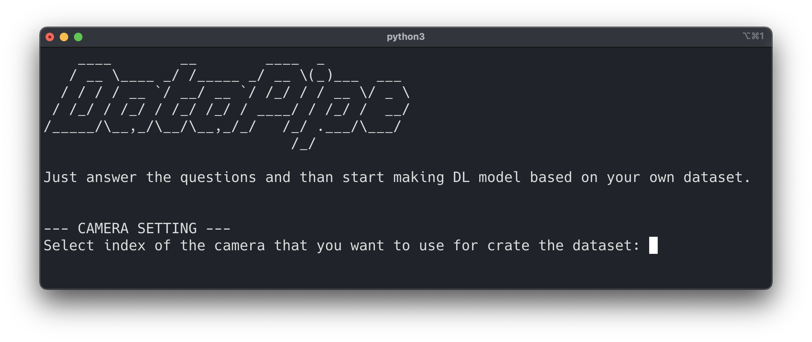
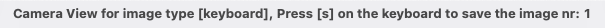

 
- [Installation](#installation)
- [Create a dataset with full UI](#create-a-dataset-with-full-ui)
  - [Other useful functions](#other-useful-functions)
  - [Script example](#script-example)
- [Create a dataset with fast UI](#create-a-dataset-with-fast-ui)
- [Create a dataset with manual UI](#create-a-dataset-with-manual-ui)
  - [How to take pictures manually](#how-to-take-pictures-manually)
- [Build datasets from different .npz files](#build-datasets-from-different-npz-files)
  - [Script example](#script-example-1)
- [Xeye datasets for deep learning](#xeye-datasets-for-deep-learning)
  

Xeye is a package for data collection to build computer vision applications based on inferential results of deep learning models. The main reasons to use Xeye are:

* Create a dataset using only a laptop and its integrated camera (or alternatively an external USB camera);
* Create a dataset already structured like the [mnist](https://www.tensorflow.org/datasets/catalog/mnist);
* Create a dataset that can be used for building models with [Tensorflow](https://www.tensorflow.org/) or [Pytorch](https://pytorch.org/).


<div id='installation'/>

## Installation

To install the package, 

```
pip install xeye
```

<div id='create-a-dataset-with-full-ui'/>

## Create a dataset with full UI 

First of all, load the module datapipe from the package:

```python
import xeye
```

then initialize the instance like this 

```python
data = xeye.Dataset()
```
set the parameters related to the images with the **init** function

```python
data.init()

```
the execution of this function causes the starting of the user interface in the **terminal** 


```console
--- CAMERA SETTING ---
Select the index of the camera that you want to use for creating the dataset: 1
``` 

the **init** function arises multiple questions that set the parameters' values


```console
--- IMAGE SETTINGS ---
Num. of types of images to scan: 2
Name of image type (1): keyboard
Name of image type (2): mouse
Num. of frames to shoot for every image type: 10
Single frame HEIGHT: 720
Single frame WIDTH:  720
num. of waiting time (in sec.) between every frame: 0
``` 

Precisely the questions refer to:

* **Select the index of the camera that you want to use for creating the dataset**: generally 0 for integrated camera, 1 for USB external camera.
* **Num. of types of images to scan**: answer 2 if you want to create a dataset with two objects (e.g. keyboard and mouse). In general, answer with the number of object types to include in your dataset.
* **Name of image type**: insert the name of every specific object you want to include in the dataset. The **init** function creates a named folder for every image type. 
* **Num. of frames to shoot for every image type**: select the number of images you want to shoot and save them in every object folder. 
* **Single frame HEIGHT**: frame height values.
* **Single frame WIDTH**: frame width values.
* **Num. of waiting time (in sec.) between every frame**: e.g 0.2 causes a waiting time of 0.2 seconds between every shoot.

After the parameters setting, you can invoke the function to start shooting images. Datapipe module provides two different formats of images:

* Grayscale image with the **gray** function;
* Color image with the **rgb** function.
  
Let's produce a dataset based on RGB images with the **rgb** function:

```python
data.rgb()
```
In the terminal keypress [b], to make photos for the image types passed to the **init** function.

```console
--- START TAKING PHOTOS ---
Press [b] on the keyboard to start data collection of image type [keyboard]
b
Press [b] on the keyboard to start data collection of image type [mouse]
b
``` 

On the directory of the script, you can find the folders that contain the images produced by the **rbg** function (e.g. keyboard folder and mouse folder). 


Images collected in the folders can be used for building datasets like the [mnist](https://www.tensorflow.org/datasets/catalog/mnist). The first approach to achieve this result is calling the **compress_train_test** function:

```python
data.compress_train_test()
```

That produces the following output in the terminal window 

```console
--- DATASET SETTING ---
percentage of images in the test set: 0.2
``` 

In which you can select the portion of images to use in the train and test datasets (write a value between (0,1)). By doing so, the function produces a **.npz** file formed by these specific tensors:

* Train set:
  * **X_train**: matrices/tensors of every single image in the train dataset;
  * **y_train**: classes (ordinal values) are associated with every image in the train dataset.
* Test set:
  * **X_test**: matrices/tensors of every single image in the test dataset;
  * **y_test**: classes (ordinal values) are associated with every image in the test dataset.
  
(matrices for grayscale images: [Height$\times$Width$\times$1], tensors for RGB images:[Height$\times$Width$\times$3]).

An alternative approach is represented by the use of the function **compress_all**

```python
data.compress_all()
```

In this case, the images are united in a unique tensor that contains all the frames produced previously. 

* Unique tensor:
  * **X**: matricies/tensors of every single image produced;
  * **y**: classes (ordinal values) are associated with every image produced.

Finally, you can use the **just_compress** function to create a unique tensor with all the images produced.

```python
data.just_compress()
```
In the terminal, you have to insert the dataset’s name

```console
--- DATASET SETTING ---
Select a name for the compressed file: batch_test
``` 
If you pass 0, by default the dataset will be save with the name **dataset_raw.npz**. The dataset produced by this function can be used by the class **BuildDataset** to put together more .npz files and create a dataset like the [mnist](https://www.tensorflow.org/datasets/catalog/mnist).

<div id='other-useful-functions'/>

### Other useful functions

* **preview**: open the camera stream to check the framing. 
  
* **var_control**: print the values of the parameters set with the **init** function. 
```console
--- PARAMETERS CONTROL ---
camera index: 1
num. of images types: 2
labels of images types: ['keyboard', 'mouse']
num. of images for types: 20
Single frame HEIGHT: 720
Single frame WIDTH:  720
waiting time between frames: 0.0
percentage of images in train dataset: 0.2
statusGray: 1
statusRGB: 0
``` 

<div id='script-example-1'/>

### Script example 

Example of a script to use the **Dataset** class:

```python
import xeye
data = xeye.dataset()
data.init()
data.preview()
data.rgb()
data.compress_train_test()
data.compress_all()
data.just_compress()

```
<div id='create-a-dataset-with-fast-ui'/>

## Create a dataset with fast UI 
A faster way to use the datapipe module is represented by the **FastDataset** class. In this case, there isn't a complete terminal UI that guides you in the construction of the dataset. With **FastDataset**, you only pass the parameters to the class, and then call the functions you need. 

```python
import xeye

# define parameters values
index = 0
img_types = 2
label = ['keyboard', 'mouse']
num = 20
height = 100
width = 100
standby_time = 0
# percentage of images in the test set 
perc = 0.2

data = xeye.FastDataset(index = index, img_types = img_types, label = label, num = num, height = height, width = width, stand_by_time = standby_time)
data.preview()
data.rgb()
data.compress_train_test(perc = perc)
data.compress_all()
data.just_compress("batch_test")
```

The parameters passed to the class **FastDataset**:

* **index**: generally 0 for integrated camera, 1 for USB external camera.
* **img_types**: numbers of object types that you want to include in your dataset.
* **label**: list of object names to include in the dataset. The **init** function creates a named folder for every image type.
* **num**: select the number of images you want to shoot and save them in every object folder.
* **height**: frame height values.
* **width**: frame width values.
* **standby_time**: e.g 0.2 cause a waiting time of 0.2 seconds between every shoot.
  
For split images in the train and test dataset, pass a value between (0,1) to the perc parameter of the **compress_train_test** function

* **perc**: the portion of images to use in the test dataset, write a value between (0,1).

If you don't pass any value to the **just_compress** function, the dataset will be saved with the name **dataset_raw.npz**.


<div id='create-a-dataset-with-manual-ui'/>

## Create a dataset with manual UI 
The **ManualDataset** class is how you can build a dataset by taking pictures manually. 

```python
import xeye

# define parameters values
index = 0
img_types = 2
label = ['keyboard', 'mouse']
num = 20
height = 100
width = 100
standby_time = 0
# percentage of images in the test set 
perc = 0.2

data = xeye.ManualDataset(index = index, img_types = img_types, label = label, num = num, height = height, width = width)
data.preview()
data.rgb()
data.compress_train_test(perc = perc)
data.compress_all()
data.just_compress("batch_test")
```

As you can see in the code snippet, the **ManualDataset** class works like the **FastDataset** class. The only difference is the absence of the **standby_time option**, which is no more necessary in this case. 

The parameters passed to the class **ManualDataset**:

* **index**: generally 0 for integrated camera, 1 for USB external camera.
* **img_types**: numbers of object types that you want to include in your dataset.
* **label**: list of object names to include in the dataset. The **init** function creates a named folder for every image type.
* **num**: select the number of images you want to shoot and save them in every object folder.
* **height**: frame height values.
* **width**: frame width values.

### How to take pictures manually

On the image window title, after the image type caption it's reported how to take pictures manually with the **ManualDataset**

* Press [s] on the keyboard to save the image nr: 1



Press [s] until you reach the number of frames passed to the **num** parameter of the class. 

## Build datasets from different .npz files 

If you want to build datasets made by different types of images, but for example, you can't shoot one of the image types that compose the dataset (because you have to wait a significant amount of time or change location), you can use the **BuildDataset** class. 

* Create datasets with the **just_compress** function;
* Create different .npz files for every type of images that composes the dataset (use the same colour spaces in all datasets, RGB or grayscale);
* Create a new script and call the **BuildDataset** class that merges all the .npz files created before.

<div id='script-example-2'/>

### Script example 

```python
import xeye
# list of directory (paths for the .npz files)
path = ['/Users/marcosalvalaggio/code/testxeye/dataset/batch_2.npz', '/Users/marcosalvalaggio/code/testxeye/dataset/batch_3.npz']
# list of labels associated with the images inside the .npz files
label = [0,1]
# initializes the class
data = xeye.BuildDataset(path=path, label=label, size = None, color=True, split=True, perc=0.2)
data.build()
```
The parameters passed to the class **BuildDataset**:

* **path**: list of files (.npz) path you want to include in the new dataset
* **label**: list of ordinal integer values representing the class type of the images inside a .npz file contained in the new dataset. In the example script, the first .npz file images are associated with class 0, while the second .npz file images are associated with class 1. Remember: always start with 0.
* **size**: tuple (height, width) for the images in the new dataset created. The default value (None) indicates that new images have the maximum height and width found in the datasets listed as dimensions
* **color**: defines if the images contained in the .npz files are RGB or grayscale. A boolean value, by default, is set to True (meaning RGB images).
* **split**: defines if you want to build a dataset split in train-test or not. A boolean value, by default, is set to True.
* **perc**: defines the percentage of images assigned to the test dataset. A floating value between (0,1). It's set to 0.1 by default.

When you want to use the **BuildDataset** class, you need to have .npz files containing images with the same types of colour spaces (all grayscale images or RGB).


<div id='xeye-datasets-for-deep-learning'/>

## Xeye datasets for deep learning 

In the [xeye-notebooks](https://github.com/marcosalvalaggio/xeye-notebooks) repository, you can find examples of deep learning model implementations based on datasets produced by the Xeye package (made with [Tensorflow](https://github.com/marcosalvalaggio/xeye-notebooks/tree/main/tensorflow) or [Pytorch](https://github.com/marcosalvalaggio/xeye-notebooks/tree/main/pytorch) frameworks).


* [Binary dataset](https://drive.google.com/drive/folders/1qvoFa4SRWirXj7kdWhhcqrQ8mTIHpkuJ?usp=sharing): containing two types of grayscale images (with labels: 0=keyboard, 1=mouse).
* [MultiLabel dataset](https://drive.google.com/drive/folders/1qvoFa4SRWirXj7kdWhhcqrQ8mTIHpkuJ?usp=sharing): containing three types of rgb images (three types of security cameras with labels: 0=dome, 1=bullet, 2=cube)
